<div align="center">

# 🚀 Workflow Orchestration with Kestra

### Data Engineering Zoomcamp - Module 2

[](https://kestra.io)
[](https://www.docker.com/)
[](https://www.python.org/)
[](https://www.postgresql.org/)
[](https://cloud.google.com/)

**Building production-ready data pipelines with modern orchestration tools**

[Overview](#-overview) •
[Workflows](#-completed-workflows) •
[Quick Start](#-quick-start) •
[Tech Stack](#️-tech-stack) •
[Resources](#-resources)

</div>

---

## 📖 Overview

This repository showcases my completion of **Module 2: Workflow Orchestration** from the [Data Engineering Zoomcamp](https://github.com/DataTalksClub/data-engineering-zoomcamp). 

The project demonstrates end-to-end data pipeline development using **Kestra**, exploring both **ETL** (Extract-Transform-Load) and **ELT** (Extract-Load-Transform) patterns with real-world NYC Taxi & Limousine Commission data.

### What I Built:
- 🔄 **8 production-ready workflows** for data ingestion and transformation
- 🐘 **Local Postgres pipelines** with scheduling and backfilling
- ☁️ **Cloud-native GCP pipelines** using BigQuery and Cloud Storage
- 🐍 **Python integration** for custom data transformations
- ⏰ **Automated scheduling** with cron-based triggers
- 🎯 **AI-assisted development** using Kestra's Copilot

---

## 📚 Table of Contents

- [Project Structure](#-project-structure)
- [Completed Workflows](#-completed-workflows)
- [Architecture](#-architecture)
- [Tech Stack](#️-tech-stack)
- [Quick Start](#-quick-start)
- [Key Learnings](#-key-learnings)
- [Resources](#-resources)

---

## 📁 Project Structure

```
02-workflow-orchestration/
├── docker-compose.yaml        # Kestra + Postgres setup
├── kestra-sandbox.json        # Kestra configuration
├── flows/                     # All Kestra workflow YAML files
│   ├── 02_python.yaml        # Python script orchestration
│   ├── 03_getting_started_data_pipeline.yaml  # Basic ETL pipeline
│   ├── 04_postgres_taxi.yaml     # Load taxi data to Postgres
│   ├── 05_postgres_taxi_scheduled.yaml  # Scheduled Postgres pipeline
│   ├── 06_gcp_kv.yaml           # GCP credentials setup
│   ├── 07_gcp_setup.yaml        # GCP resource creation
│   ├── 08_gcp_taxi.yaml         # Load taxi data to BigQuery
│   └── 9_gcp_taxi_schedule.yaml # Scheduled BigQuery pipeline
└── README.md                   # This file
```

---

## 🔄 Completed Workflows

<table>
<tr>
<td width="50%">

### 🏠 Local Database Pipelines

| Workflow | Description |
|----------|-------------|
| **[02_python.yaml](flows/02_python.yaml)** | Python script orchestration with Docker Hub API |
| **[03_getting_started_data_pipeline.yaml](flows/03_getting_started_data_pipeline.yaml)** | Basic ETL with HTTP, Python & DuckDB |
| **[04_postgres_taxi.yaml](flows/04_postgres_taxi.yaml)** | NYC Taxi data → Postgres with monthly partitioning |
| **[05_postgres_taxi_scheduled.yaml](flows/05_postgres_taxi_scheduled.yaml)** | Scheduled pipeline with backfilling (9 AM UTC) |

</td>
<td width="50%">

### ☁️ Cloud Pipelines (GCP)

| Workflow | Description |
|----------|-------------|
| **[06_gcp_kv.yaml](flows/06_gcp_kv.yaml)** | GCP credentials configuration |
| **[07_gcp_setup.yaml](flows/07_gcp_setup.yaml)** | Automated GCS + BigQuery setup |
| **[08_gcp_taxi.yaml](flows/08_gcp_taxi.yaml)** | ELT: CSV → GCS → BigQuery |
| **[9_gcp_taxi_schedule.yaml](flows/9_gcp_taxi_schedule.yaml)** | Dual-schedule pipeline (Yellow & Green) |

</td>
</tr>
</table>

---

## 🏗️ Architecture

### ETL Pipeline (Local - Postgres)

```mermaid
graph LR
    A[🌐 Extract CSV from GitHub] --> B[🐍 Transform with Python]
    B --> C[🐘 Load to PostgreSQL]
    C --> D[📊 Query & Analyze]
    style A fill:#e1f5ff
    style B fill:#fff4e1
    style C fill:#e8f5e9
    style D fill:#f3e5f5
```


### ELT Pipeline (Cloud - BigQuery)

```mermaid
graph LR
    A[🌐 Extract CSV] --> B[☁️ Load to GCS]
    B --> C[📊 External Table in BigQuery]
    C --> D[🔄 Transform in BigQuery]
    D --> E[✅ Production Table]
    style A fill:#e1f5ff
    style B fill:#fff4e1
    style C fill:#e8f5e9
    style D fill:#fff59d
    style E fill:#c8e6c9
```


---

## 🛠️ Tech Stack

<div align="center">

| Category | Technologies |
|----------|-------------|
| **Orchestration** | Kestra (v1.1) |
| **Containerization** | Docker, Docker Compose |
| **Databases** | PostgreSQL 18, DuckDB |
| **Cloud** | Google Cloud Platform (GCS, BigQuery) |
| **Languages** | Python 3.11+, SQL, YAML |
| **Data Source** | NYC TLC Trip Record Data |

</div>

---

## 🚀 Quick Start

### Prerequisites

Before you begin, ensure you have:

- ✅ Docker & Docker Compose installed ([Download here](https://www.docker.com/get-started))
- ✅ GCP account with service account (for cloud pipelines - [Setup guide](https://cloud.google.com/iam/docs/service-accounts))
- ✅ 8GB RAM minimum for smooth Docker operations

### Installation

1️⃣ **Clone the repository**
```bash
git clone <your-repo-url>
cd 02-workflow-orchestration
```

2️⃣ **Start Kestra services**
```bash
docker compose up -d
```

3️⃣ **Access Kestra UI**

Open your browser and navigate to: **http://localhost:8080**

4️⃣ **Run your first workflow**
- Navigate to **Flows** in the Kestra UI
- Select any workflow (try `03_getting_started_data_pipeline.yaml` first)
- Click **Execute** button
- Monitor execution in real-time

### Stopping Services

```bash
docker compose down
```

To remove all data and start fresh:
```bash
docker compose down -v
```

---

## 💡 Key Learnings

<details>
<summary><b>🎯 Workflow Orchestration Fundamentals</b></summary>

- Understanding the role of orchestrators in data engineering
- Comparing orchestration tools (Kestra, Airflow, Prefect)
- Building declarative workflows with YAML
- Event-driven vs scheduled workflows
</details>

<details>
<summary><b>🔄 ETL vs ELT Patterns</b></summary>

- **ETL**: Transform data locally before loading (good for small datasets)
- **ELT**: Load first, transform in the warehouse (scalable for large datasets)
- When to use each pattern based on data volume and complexity
</details>

<details>
<summary><b>⏰ Scheduling & Backfilling</b></summary>

- Cron-based scheduling for automated pipeline execution
- Backfilling historical data without duplicates
- Handling incremental data loads with partitioning
</details>

<details>
<summary><b>☁️ Cloud-Native Data Engineering</b></summary>

- Migrating from local Postgres to cloud-based BigQuery
- Using GCS as a data lake for staging raw data
- Leveraging BigQuery's compute for transformations
- Managing cloud credentials securely
</details>

<details>
<summary><b>🤖 AI-Assisted Development</b></summary>

- Using Kestra's AI Copilot to generate workflows
- Understanding context engineering for better AI outputs
- RAG (Retrieval Augmented Generation) in data pipelines
</details>

---

## 📊 Project Highlights

| Metric | Achievement |
|--------|-------------|
| **Workflows Built** | 8 production-ready pipelines |
| **Data Processed** | NYC Taxi data (Yellow & Green taxis) |
| **Pipeline Types** | ETL (Postgres) + ELT (BigQuery) |
| **Automation** | Scheduled daily execution with backfilling |
| **Cloud Integration** | GCS + BigQuery + Docker |
| **Languages Used** | Python, SQL, YAML |

---

## 📚 Resources & Documentation

### Official Course Materials
- 📺 [Module 2 Video Playlist](https://www.youtube.com/playlist?list=PL3MmuxUbc_hJed7dXYoJw8DoCuVHhGEQb)
- 📖 [Course Repository](https://github.com/DataTalksClub/data-engineering-zoomcamp)
- 💬 [Community Slack](https://datatalks.club/slack.html)

### Kestra Resources
- 📘 [Kestra Documentation](https://kestra.io/docs)
- 🎯 [Kestra Blueprints](https://kestra.io/blueprints)
- 🔌 [Plugin Library (600+)](https://kestra.io/plugins)
- ⭐ [GitHub Repository](https://github.com/kestra-io/kestra)

### NYC Taxi Dataset
- 📊 [TLC Trip Record Data](https://www.nyc.gov/site/tlc/about/tlc-trip-record-data.page)

---

## 🎓 About This Course

<div align="center">

**Data Engineering Zoomcamp**  
*A free online bootcamp by [DataTalksClub](https://datatalks.club/)*

**Module 2: Workflow Orchestration**  
**Completion Date:** February 2026  
**Cohort:** 2026

</div>

---

## 🤝 Contributing

Found an issue or have suggestions? Feel free to:
- Open an issue
- Submit a pull request
- Share your feedback

---

## 📝 License

This project is part of the Data Engineering Zoomcamp course materials. Please refer to the [original course repository](https://github.com/DataTalksClub/data-engineering-zoomcamp) for license information.

---

## 🌟 Acknowledgments

- **[DataTalksClub](https://datatalks.club/)** for the excellent free course
- **[Kestra Team](https://kestra.io/)** for their amazing orchestration platform
- **NYC TLC** for providing the open dataset

---

<div align="center">

### 🚀 If you found this helpful, please ⭐ star this repository!

**[Back to Top](#-workflow-orchestration-with-kestra)**

---

Made with ❤️ as part of Data Engineering Zoomcamp 2026

</div>
